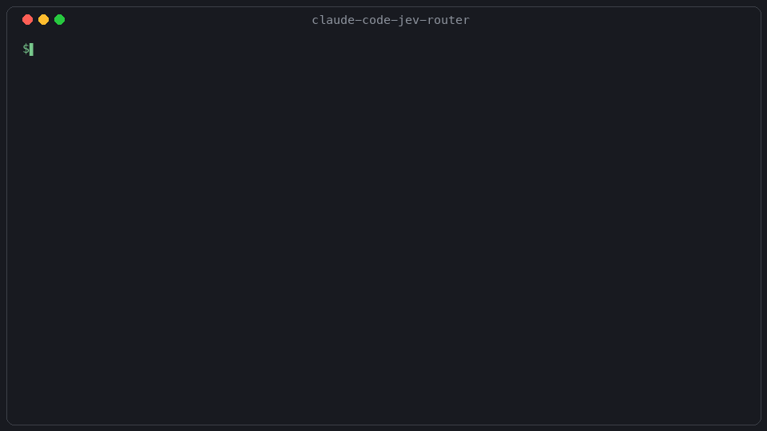

# claude-code-jev-router

**Picks the model tier for a delegated Claude Code task before it spawns.** Cheap work goes to a cheap model. Hard work doesn't.

Opt-in per repository. Reversible in one command. Fails safe.

```bash
./jev install /path/to/your/repo --yes
```



---

## Should you use this?

Yes, if you delegate work to subagents in Claude Code and you'd rather not pay frontier rates for every `Explore` task.

No, if you want it to make Claude Code *feel* faster. It won't, and the section below shows the measurement.

Not yet, if you want a proven savings number. There isn't one. This went live only just now, and no result has been collected. A README claiming a percentage would be making it up.

---

## What it actually does

Claude Code fires a `PreToolUse` hook before it spawns a subagent. This tool registers a hook there, looks at the `subagent_type`, and rewrites `model` according to a table you control.

```
  you: "go explore the codebase"
        |
        v
  Claude Code prepares a subagent  ──►  [ jev hook, ~25ms ]
        |                                      |
        |                          reads config/tiers.json
        |                          Explore -> haiku
        v                                      |
  subagent runs on haiku  ◄────────────────────┘
```

v0.1 contains no AI. It is a lookup table, and that is the most interesting decision in the project.

---

## Why a lookup table, and not a classifier

Five independent studies find that learned routers often fail to beat a trivial static baseline: LLMRouterBench (400K instances, 21 datasets), RouterArena's "routing plateau", kNN outperforming MLP and GNN routers, and RouteLLM scoring near random on MMLU. Published static heuristics, meanwhile, deliver real savings.

So the dumb version ships first, and anything cleverer has to beat it on measured cost at equal task success. The baseline is the product until something outperforms it.

---

## What it cannot do

It cannot make you wait less. Measured on a real session, the median subagent task ran for **794.6s** while the median *blocking* duration was **1.5s**. That is a 530× gap, because delegated tasks run in the background. Making them faster does not change how long the human waits.

This is a cost and rework tool, not a latency tool.

Its reach is small. The tier map only routes tasks that carry a meaningful `subagent_type`. `general-purpose`, which is the majority of delegations by every count taken, is left untouched on purpose, because the type name says nothing about the work. Coverage is roughly **12 to 35% of delegated tasks**, and delegated work is roughly **24% of spend**.

Don't multiply those together and quote the result. Nobody has measured the product.

---

## Why you can trust the off-switch

Most of the engineering here went into making it safe to install rather than making it clever.

- Fail-safe, always. Every hook exits 0. It cannot break or block a session.
- It fails to *frontier*, never to cheap. If the router errors on a task it was meant to route, that task goes to the expensive model. A failure never silently downgrades your work.
- A circuit breaker. After three consecutive failures it stops rewriting entirely and says so. State persists to disk, because every hook invocation is a fresh process.
- Three kill switches: global, machine-wide and per-project. Any one of them stops it deciding.
- 48 reversibility assertions, including from a clean checkout, ending in `OFF IS PROVEN EQUAL TO VANILLA`. That is a test that runs, not a sentence in a README.
- Tiered uninstall. Byte-reversible when it can be, verified by sha256. When it can't be, because you edited your settings after installing, it says so instead of pretending.
- No network in the routing path. No telemetry. Nothing is ever written to `~/.claude/settings.json`.

---

## Install

```bash
git clone https://github.com/aadhar-build/claude-code-jev-router
cd claude-code-jev-router

./jev install /path/to/your/repo --dry-run   # read what it would do
./jev install /path/to/your/repo --yes       # do it
```

Then start a new Claude Code session in that repo. Hooks are read at session start.

### See a decision

```bash
cat data/agent_route/assignments/$(date -u +%F).jsonl
```

One line per delegated task: what was assigned, which rule fired, and the outcome.

### Stop it

```bash
touch .jev-disabled     # stops it deciding, instantly, from any directory
rm .jev-disabled        # resume
```

### Remove it

```bash
./jev uninstall /path/to/your/repo --yes
```

A switch stops it *deciding*. `uninstall` is what makes it *quiescent*. Those are different things, and the CLI tells you which one you have achieved.

### Configure

`config/tiers.json` is the policy. The hook contains no tier literal, so changing routing means editing that file, not a script. Every rule carries a `basis` field saying why it's there. The map is a declared policy choice, not something fitted to data.

---

## For coding agents

If you are an agent installing this:

1. Run `./jev install <repo> --dry-run` first and read the output. It names every entry it will add.
2. Install merges into `<repo>/.claude/settings.local.json`. It does not overwrite. Pre-existing hooks survive.
3. Never write to `~/.claude/settings.json`. This tool is per-project by design.
4. After install the user must start a new session. Hooks are read at session start.
5. `general-purpose` is unrouted on purpose. Do not "fix" it by adding a tier.
6. If a task must not be routed, set `model` explicitly in the `Agent` call. The router leaves caller-set models alone.
7. To diagnose, run `./jev status`, then `src/doctor.py`, then read the ledger, in that order.

Outcomes recorded per decision: `routed`, `no_rule`, `explicit_model_kept`, `fail_to_frontier`, `breaker_open`.

---

## Requirements

Python 3.12+, `jq`, macOS or Linux. Every import is stdlib, so there is nothing to install.

```bash
bash tests/run_all.sh
```

---

## Status

v0.1, just armed. The routing works and is tested. No savings have been measured yet, and the effect on task quality is monitored after the fact rather than proven in advance.

This repository began as a measurement experiment asking whether a cheap non-generative model could replace Claude Code's decision-making. The measurement said no: putting a classifier in front of every tool call *adds* about 337 tokens and 557ms per call and removes nothing. Routing delegated work was the one place where the economics ran the other way, so the experiment became this tool.

A fuller write-up, including the things this project got wrong and caught, is coming.

## Licence

MIT. Built by [Aadhar Agarwal](https://aadhar.build); the write-ups on routing and evals live there.
